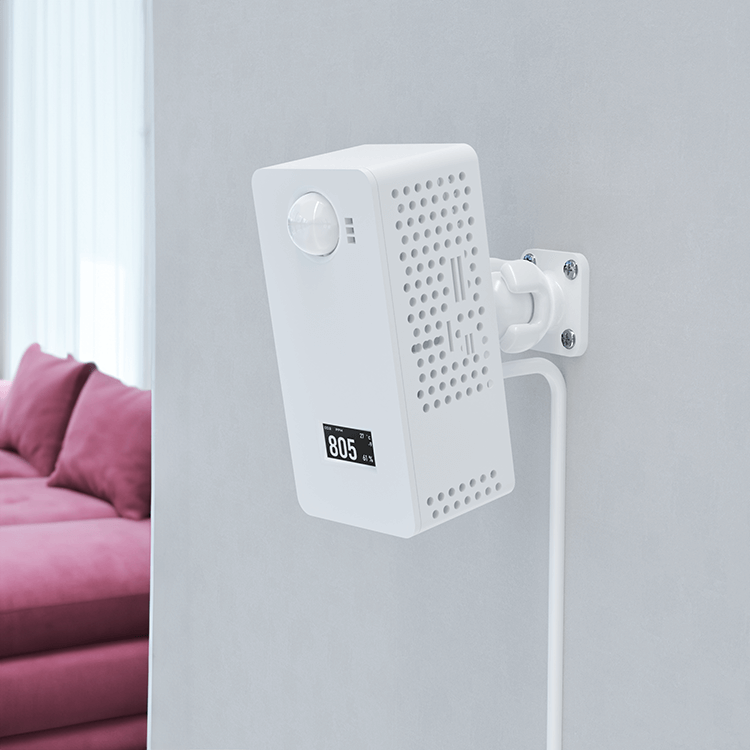

# UltimateSensor for Home Assistant / ESPHome



UltimateSensor is an ESPHome-based room sensor for Home Assistant. It measures air quality, occupancy, light, temperature, humidity, VOC/NOx index values, and optionally particulate matter, with local operation over WiFi or Ethernet/PoE.

Product page: https://ultimatesensor.nl/en

## How It Works

UltimateSensor combines multiple room sensors on one ESP32 device. The ESPHome firmware exposes all measurements directly to Home Assistant and supports WiFi or wired Ethernet depending on the firmware variant.

The Basic firmware uses the shared configuration without the SPS30 particulate matter sensor. The Complete firmware adds SPS30 particulate matter measurements and Home Assistant controls for the PM sensor and night mode.

## Key Features

- CO2 sensing with SCD41
- Temperature and humidity sensing
- Light sensing with BH1750
- VOC and NOx index sensing with SGP4x
- LD2450 mmWave occupancy and target tracking
- OLED display with Home Assistant LCD display control
- RGB back light and ESP status LED
- WiFi firmware with captive portal fallback
- Ethernet firmware for wired connectivity and PoE installations
- Optional SPS30 particulate matter sensing in the Complete variant
- PM sensor and Night Mode controls in the Complete variant
- Fully local operation with ESPHome and Home Assistant

## Hardware Versions

| Version | Chip | Connectivity | Description |
|---------|------|--------------|-------------|
| V1 | ESP32 | WiFi, Ethernet, and PoE | UltimateSensor hardware with Basic and Complete firmware variants |

## Variants

We publish customer-facing WiFi and Ethernet firmware variants for the V1 hardware.

| Hardware | Variant | Description |
|----------|---------|-------------|
| V1 (ESP32) | WiFi Basic | WiFi firmware without the SPS30 particulate matter sensor |
| V1 (ESP32) | WiFi Complete | WiFi firmware with SPS30 particulate matter sensing |
| V1 (ESP32) | Ethernet Basic | Ethernet firmware without the SPS30 particulate matter sensor |
| V1 (ESP32) | Ethernet Complete | Ethernet firmware with SPS30 particulate matter sensing |

## Sensors

| Sensor | Description |
|--------|-------------|
| CO2 | Room CO2 concentration |
| Temperature | Environment temperature |
| Humidity | Environment humidity |
| Light | Ambient light level |
| VOC Index | Volatile organic compound index |
| NOx Index | Nitrogen oxide index |
| Occupancy | mmWave occupancy detection |
| Target Position | LD2450 target X/Y position, speed, angle, distance, and resolution |
| PM1.0 / PM2.5 / PM4.0 / PM10 | Particulate matter measurements in the Complete variant |
| WiFi Signal | WiFi signal strength in WiFi variants |
| Uptime | Device uptime |

## Getting Started

1. Power the UltimateSensor with USB-C or PoE where supported.
2. Flash the desired firmware with the web flasher or ESPHome CLI.
3. If WiFi is not configured yet, connect to the fallback hotspot.
4. Add the device to Home Assistant through the ESPHome integration.
5. Use the LCD display, PM sensor, and Night Mode controls from Home Assistant where available.

Web flasher: https://smarthomeshop.io/en/firmware
Product page: https://ultimatesensor.nl/en

## Version History

- Customer-facing release notes: [CHANGELOG.md](CHANGELOG.md)
- GitHub Releases: https://github.com/smarthomeshop/ultimatesensor/releases

## Repository Layout

```text
ultimatesensor/
├── ultimatesensor-v1/                  # V1 ESPHome configurations
│   ├── base.yaml                       # Shared device, sensors, display, and controls
│   ├── wifi.yaml                       # Shared WiFi connectivity package
│   ├── ethernet.yaml                   # Shared Ethernet connectivity package
│   ├── complete.yaml                   # SPS30 particulate matter package
│   ├── ultimatesensor-wifi-basic.yaml
│   ├── ultimatesensor-wifi-complete.yaml
│   ├── ultimatesensor-ethernet-basic.yaml
│   └── ultimatesensor-ethernet-complete.yaml
├── .github/workflows/                  # Build and release automation
├── CHANGELOG.md                        # Customer-facing firmware notes
└── images/
```

## Firmware Downloads

Pre-built firmware manifests are published on the `gh-pages` branch.

- WiFi Basic: `ultimatesensor-wifi-basic-manifest.json`
- WiFi Complete: `ultimatesensor-wifi-complete-manifest.json`
- Ethernet Basic: `ultimatesensor-ethernet-basic-manifest.json`
- Ethernet Complete: `ultimatesensor-ethernet-complete-manifest.json`

## Contributing

PRs and issues are welcome. Please keep changes modular and follow ESPHome best practices.

If a PR changes firmware behavior or release-visible functionality, add a customer-facing note to [CHANGELOG.md](CHANGELOG.md) under `Unreleased`.

## Support

- Product info and guides: https://ultimatesensor.nl/en
- Store: https://smarthomeshop.io
- Community and support: https://smarthomeshop.io/discord

## License

This project is released under the CC BY-NC 4.0 license. See [license](license).
