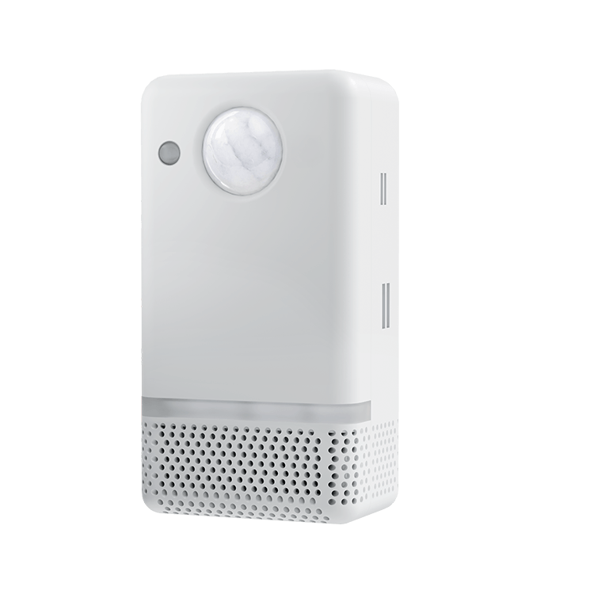

# UltimateSensor for Home Assistant / ESPHome

<p align="center">
  
  
</p>

<table align="center">
  <tr>
    <th>UltimateSensor V1</th>
    <th>UltimateSensor V2 · 2026</th>
  </tr>
  <tr>
    <td valign="top">
      <ul>
        <li>ESP32 with WiFi or Ethernet with PoE support</li>
        <li>LD2450 mmWave target tracking</li>
        <li>PIR motion sensing and an OLED display</li>
        <li>CO2, temperature, humidity, VOC/NOx and illuminance (lux)</li>
        <li>Basic and Complete with optional particulate matter measurements: PM1.0, PM2.5, PM4.0 and PM10</li>
      </ul>
    </td>
    <td valign="top">
      <ul>
        <li>ESP32-S3 with WiFi or Ethernet with PoE support</li>
        <li>LD2412 presence plus LD2450 target tracking</li>
        <li>Optional LD2460 upgrade replacing the LD2450</li>
        <li>PIR, microphone and speaker for Voice Assistant</li>
        <li>CO2, temperature, humidity, VOC/NOx and illuminance (lux)</li>
        <li>Basic and Complete with optional particulate matter measurements: PM1.0, PM2.5, PM4.0 and PM10</li>
      </ul>
    </td>
  </tr>
</table>

UltimateSensor is an ESPHome-based room sensor for Home Assistant. It measures air quality, occupancy, light, temperature, humidity, VOC/NOx index values, and optionally particulate matter, with local operation over WiFi or Ethernet/PoE.

Product page: [https://ultimatesensor.nl/en](https://ultimatesensor.nl/en)

## How It Works

UltimateSensor combines multiple room sensors on one ESP32 device. The ESPHome firmware exposes all measurements directly to Home Assistant and supports WiFi or wired Ethernet depending on the firmware variant.

The Basic firmware uses the shared configuration without the SPS30 particulate matter sensor. The Complete firmware adds SPS30 particulate matter measurements and Home Assistant controls for the PM sensor and night mode. UltimateSensor V2 is sold standard with LD2412 + LD2450. Customers who buy the optional LD2460 upgrade remove/replace the LD2450 module and flash a dedicated `LD2460` firmware variant while leaving LD2412 installed.

## Key Features

- CO2 sensing with SCD41
- Temperature and humidity sensing
- Light sensing with BH1750
- VOC and NOx index sensing with SGP4x
- LD2412 close-range mmWave presence sensing on V2
- LD2450 mmWave occupancy and target tracking as the standard V2 tracking radar
- Optional LD2460 target tracking upgrade firmware for V2
- PIR motion sensing
- I2S microphone, speaker media player, and local wake word on V2, with either
  Home Assistant Voice Assistant or SmartHomeShop Cloud Voice firmware
- OLED display with Home Assistant LCD display control
- RGB back light and ESP status LED
- Optional automatic motion light, scheduled night light, and CO2 warning light
- WiFi firmware with captive portal fallback
- Ethernet firmware for wired connectivity and PoE installations
- Optional SPS30 particulate matter sensing in the Complete variant
- SPS30 idle-cycle controls aligned with UltimateSensor Mini to reduce fan/laser runtime
- PM sensor and Night Mode controls in the Complete variant
- Fully local operation with ESPHome and Home Assistant

## Hardware Versions

| Version | Chip | Connectivity | Description |
|---------|------|--------------|-------------|
| V1 | ESP32 | WiFi, Ethernet, and PoE | UltimateSensor hardware with ESP-IDF firmware, LD2450 tracking, PIR, OLED display, and Basic/Complete firmware variants |
| V2 | ESP32-S3 | WiFi, W5500 Ethernet, and PoE | UltimateSensor V2 hardware with LD2412 + LD2450 standard, optional LD2460 upgrade firmware, PIR, microphone, speaker, and Basic/Complete variants |

## Variants

We publish customer-facing WiFi and Ethernet firmware variants for V1 and V2 hardware.

| Hardware | Variant | Description |
|----------|---------|-------------|
| V1 (ESP32) | WiFi Basic | WiFi firmware without the SPS30 particulate matter sensor |
| V1 (ESP32) | WiFi Complete | WiFi firmware with SPS30 particulate matter sensing |
| V1 (ESP32) | Ethernet Basic | Ethernet firmware without the SPS30 particulate matter sensor |
| V1 (ESP32) | Ethernet Complete | Ethernet firmware with SPS30 particulate matter sensing |
| V2 (ESP32-S3) | WiFi Basic | WiFi firmware without the SPS30 particulate matter sensor |
| V2 (ESP32-S3) | WiFi Complete | WiFi firmware with SPS30 particulate matter sensing |
| V2 (ESP32-S3) | Ethernet Basic | W5500 Ethernet firmware without the SPS30 particulate matter sensor |
| V2 (ESP32-S3) | Ethernet Complete | W5500 Ethernet firmware with SPS30 particulate matter sensing |
| V2 (ESP32-S3) | WiFi/Ethernet Basic LD2460 | Optional LD2460 upgrade firmware without SPS30 |
| V2 (ESP32-S3) | WiFi/Ethernet Complete LD2460 | Optional LD2460 upgrade firmware with SPS30 |

## Sensors

| Sensor | Description |
|--------|-------------|
| CO2 | Room CO2 concentration |
| Temperature | Environment temperature |
| Humidity | Environment humidity |
| Light | Ambient light level |
| VOC Index | Volatile organic compound index |
| NOx Index | Nitrogen oxide index |
| Occupancy | PIR and mmWave occupancy detection |
| LD2412 | Close-range mmWave presence, moving/still target, and engineering controls on V2 |
| Target Position | LD2450 target X/Y position, speed, angle, distance, and resolution by default; LD2460 target X/Y, distance, and angle in upgrade firmware |
| Microphone | I2S microphone RMS/peak sound level diagnostics on V2 |
| Voice Assistant | Local wake-word detection with Home Assistant or SmartHomeShop Cloud Voice on V2 |
| Speaker | I2S speaker media player on V2 |
| PM1.0 / PM2.5 / PM4.0 / PM10 | Particulate matter measurements in the Complete variant |
| WiFi Signal | WiFi signal strength in WiFi variants |
| Uptime | Device uptime |

## Getting Started

> **UltimateSensor V1 2.0 migration:** Devices running V1 firmware 1.13 or
> older require one full USB-C installation to migrate from Arduino to
> ESP-IDF. Remove the V1 LD2450 module before USB flashing, reinstall it after
> flashing, and then use normal OTA updates for future 2.x releases.

1. Power the UltimateSensor with USB-C or PoE where supported.
2. Flash the desired firmware with the web flasher or ESPHome CLI.
3. If WiFi is not configured yet, connect to the fallback hotspot.
4. Add the device to Home Assistant through the ESPHome integration.
5. For V2 LD2460 upgrades, physically replace/remove the LD2450 module first, leave LD2412 installed, and flash one of the `*-ld2460` firmware files.
6. Use the LCD display, PM sensor, and Night Mode controls from Home Assistant where available.

For LD2460 module orientation and wall calibration, follow the
[UltimateSensor V2 LD2460 upgrade guide](ultimatesensor-v2/LD2460-UPGRADE.md).

Web flasher: https://smarthomeshop.io/en/firmware
Product page: https://ultimatesensor.nl/en

## Version History

- Customer-facing release notes: [CHANGELOG.md](CHANGELOG.md)
- GitHub Releases: https://github.com/smarthomeshop/ultimatesensor/releases

## Repository Layout

```text
ultimatesensor/
├── ultimatesensor-v1/                  # V1 ESPHome configurations
│   ├── base.yaml                       # Shared device, sensors, display, and controls
│   ├── wifi.yaml                       # Shared WiFi connectivity package
│   ├── ethernet.yaml                   # Shared Ethernet connectivity package
│   ├── complete.yaml                   # SPS30 particulate matter package
│   ├── ultimatesensor-wifi-basic.yaml
│   ├── ultimatesensor-wifi-complete.yaml
│   ├── ultimatesensor-ethernet-basic.yaml
│   └── ultimatesensor-ethernet-complete.yaml
├── ultimatesensor-v2/                  # V2 ESP32-S3 ESPHome configurations
│   ├── base.yaml                       # Shared sensors, PIR, LD2412, microphone, speaker, and occupancy logic
│   ├── tracking-ld2450.yaml            # Standard factory tracking package
│   ├── tracking-ld2460.yaml            # Optional LD2460 upgrade package
│   ├── wifi.yaml                       # Shared WiFi connectivity package
│   ├── ethernet.yaml                   # Shared W5500 Ethernet connectivity package
│   ├── voice-assistant.yaml            # Local wake word and Home Assistant voice assistant package
│   ├── cloud-voice.yaml                # Local wake word and SmartHomeShop Cloud Voice package
│   ├── complete.yaml                   # SPS30 particulate matter package
│   ├── ultimatesensor-v2-wifi-basic.yaml
│   ├── ultimatesensor-v2-wifi-complete.yaml
│   ├── ultimatesensor-v2-ethernet-basic.yaml
│   ├── ultimatesensor-v2-ethernet-complete.yaml
│   └── ultimatesensor-v2-*-*-ld2460.yaml
├── .github/workflows/                  # Build and release automation
├── CHANGELOG.md                        # Customer-facing firmware notes
└── images/
```

## Firmware Downloads

Pre-built firmware manifests are published on the `gh-pages` branch.

- WiFi Basic: `ultimatesensor-wifi-basic-manifest.json`
- WiFi Complete: `ultimatesensor-wifi-complete-manifest.json`
- Ethernet Basic: `ultimatesensor-ethernet-basic-manifest.json`
- Ethernet Complete: `ultimatesensor-ethernet-complete-manifest.json`
- V2 WiFi Basic: `ultimatesensor-v2-wifi-basic-manifest.json`
- V2 WiFi Complete: `ultimatesensor-v2-wifi-complete-manifest.json`
- V2 Ethernet Basic: `ultimatesensor-v2-ethernet-basic-manifest.json`
- V2 Ethernet Complete: `ultimatesensor-v2-ethernet-complete-manifest.json`
- V2 WiFi Basic LD2460: `ultimatesensor-v2-wifi-basic-ld2460-manifest.json`
- V2 WiFi Complete LD2460: `ultimatesensor-v2-wifi-complete-ld2460-manifest.json`
- V2 Ethernet Basic LD2460: `ultimatesensor-v2-ethernet-basic-ld2460-manifest.json`
- V2 Ethernet Complete LD2460: `ultimatesensor-v2-ethernet-complete-ld2460-manifest.json`
- V2 WiFi Basic Cloud: `ultimatesensor-v2-wifi-basic-cloud-manifest.json`
- V2 WiFi Complete Cloud: `ultimatesensor-v2-wifi-complete-cloud-manifest.json`
- V2 Ethernet Basic Cloud: `ultimatesensor-v2-ethernet-basic-cloud-manifest.json`
- V2 Ethernet Complete Cloud: `ultimatesensor-v2-ethernet-complete-cloud-manifest.json`
- V2 WiFi Basic LD2460 Cloud: `ultimatesensor-v2-wifi-basic-ld2460-cloud-manifest.json`
- V2 WiFi Complete LD2460 Cloud: `ultimatesensor-v2-wifi-complete-ld2460-cloud-manifest.json`
- V2 Ethernet Basic LD2460 Cloud: `ultimatesensor-v2-ethernet-basic-ld2460-cloud-manifest.json`
- V2 Ethernet Complete LD2460 Cloud: `ultimatesensor-v2-ethernet-complete-ld2460-cloud-manifest.json`

## Contributing

PRs and issues are welcome. Please keep changes modular and follow ESPHome best practices.

If a PR changes firmware behavior or release-visible functionality, add a customer-facing note to [CHANGELOG.md](CHANGELOG.md) under `Unreleased`.

## Support

- Product info and guides: https://ultimatesensor.nl/en
- Store: https://smarthomeshop.io
- Community and support: https://smarthomeshop.io/discord

## License

This project is released under the CC BY-NC 4.0 license. See [license](license).
